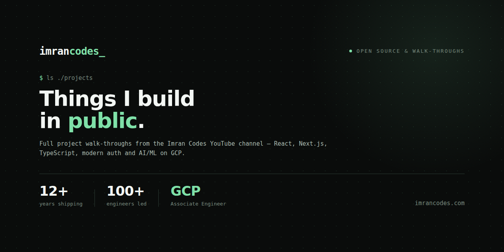

### Tech Lead · Lead AI/ML Engineer

Twelve years shipping production systems in TypeScript, React, Node and Python.
Now leading AI/ML engineering on Google Cloud — RAG, agents, evaluation and the
MLOps underneath them.

I lead engineering teams, mentor developers into leadership, and still write
code every day. The throughline across everything I build is systems that live
under real audit, RBAC and data-handling constraints. Guardrails aren't a
blocker — they're how I already work.

```
$ whoami
tech-lead · lead-ai-ml-engineer

$ cat stack.txt
typescript · react · next · node · graphql
python · pytorch · vertex-ai · langgraph
gcp · bigquery · cloud-run · terraform

$ ls ./now
production RAG and agent systems on GCP
```

---

### Teaching

I run **[Imran Codes](https://www.youtube.com/@imrancodes)** — full project
walk-throughs, not toy demos. Real auth, real deployment, real trade-offs.

|  |  |
| --- | --- |
| **1.6k+** | developers following along |
| **34** | articles at [imrancodes.com](https://imrancodes.com) |
| **12+** | years shipping production systems |
| **100+** | engineers led |
| **GCP** | Associate Engineer certified |

**Code. Ship. Level up.**

---

### Elsewhere

- **Site and writing** — [imrancodes.com](https://imrancodes.com)
- **YouTube** — [@imrancodes](https://www.youtube.com/@imrancodes)
- **LinkedIn** — [in/imran-codes](https://www.linkedin.com/in/imran-codes/)
- **X** — [@imran_codes](https://twitter.com/imran_codes)
- **Email** — imran@imrancodes.com

Three free e-books for frontend developers —
[imrancodes.com/ebooks](https://imrancodes.com/ebooks#newsletter)

---

<sub>Open to select consulting: full-stack delivery, AI/ML on GCP, and coaching
engineers into tech lead roles. Two cats, neither of them impressed.</sub>
